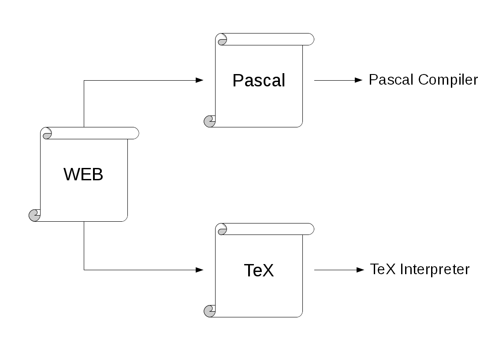
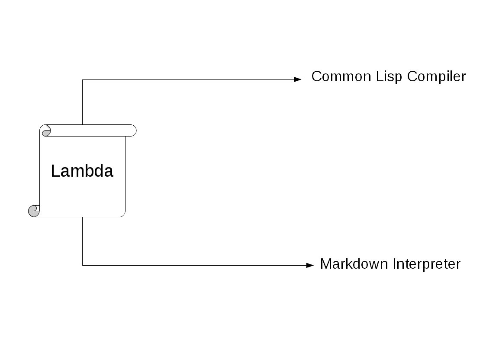

    (in-package #:cl-user)
    (defpackage #:lambda.README
      (:use :cl :lambda :named-readtables))
    (in-package #:lambda.README)
    (in-readtable :lambda)

# Lambda
A literate programming tool

## Table of Contents

1. About This Project
    1. Philosophy
    2. Copyright
    3. License
    4. Precautions
2. Tutorials
    1. REPL
    2. ASDF
3. Reference
    1. Lamdba
4. Appendix(./appendix.md)
    1. FAQ
    3. Emacs Lisp

## About This Project

### Philosophy

*Lambda* is the name of a programming style as well as the name of a tool 
with which to implement it. The author of *Lambda* developed it to do 
literate programming in LISP better than WEB, developed by Donald Knuth. 
WEB and it's derived softwares are used in various programming languages. 
They require developers compiling with them to obtain the source code.
It is required in order to do literate programming in C and Pascal, but isn't 
in Common Lisp because Common Lisp has the reader macro which changes the
source code when the system reads it.

<div style="display:flex;height:200px;justify-content:center;">
  
  
</div>

*Lambda* makes your markdown executable with the reader macro of Common Lisp.
For example, the author wrote this document with *Lambda*. You can execute it 
by running `ros run -l lambda.asd -e '(require :lambda)' -l README.md -q`.
How about this? Let's make your project more beautiful and useful!

```lisp
(princ "Hello, Lambda!")
```

### Copyright

Copyright (c) 2017 TANIGUCHI Masaya All Rights Reserved

### License

MIT. See the [license texts](./LICENSE).

### Precaution

This is a new project. Please send me your feedback if you find any issues.

- [Project home](https://github.com/ta2gch/lambda)

## Tutorials

In *Lambda*, you can write any text but you have to write a title (`# `) at 
the top of the document, like the following, and make the file extension
`.l.md` or `.md`. In order to make it distinguishable from non-executable 
Markdown, I recommend using `.l.md`. Also, you can write with Markdown, 
especially CommonMark whose specification can be found at 
[commonmark.org](https://commonmark.org). *Lambda* only evaluates codeblocks
*after* the title (`# `) that are enclosed by ` ```lisp ` and ` ``` `. The 
indented codeblock *before* the title (`# `) is important, as this codeblock 
specifies the required packages. Please do not forget it.

        (in-package :cl-user)
        (defpackage :tutorial
          (:use :cl :lambda :named-readtables)
          (:export :hello)
        (in-package :tutorial)
        (in-readtable :lambda)

    # My First Document

    This is my first document.
    This will say "Hello, world!".

    ```lisp
    (defun hello ()
      (princ "Hello, world!"))
    ```

If you try this tutorial, save it as `tutorial.l.md`, as this is the filename
used in this section. Now, there are two ways to generate the document, 
**REPL** and **ASDF**. The following are quick tutorials for each. For more 
information, please see the **Reference** section.

### REPL

A REPL is a good environment to experiment with your *Lamda* documents. We 
can load them and test the behaivor quickly and it is convenient to use them
with *SLIME*.

#### Installation

Unfortunately, *Lambda* is NOT available in QuickLisp. Currently, You can 
install *Lambda* with [Roswell](https://github.com/roswell/roswell).

    $ ros install ta2gch/lambda

Next you can load document as follows:

    > (require :lambda)
    nil
    > (load #p"tutorial.l.md")
    nil
    > (tutorial:hello)
    Hello, World!

### ASDF

Let's write a small project whose files are the following.

    tutorial.asd
    tutorial.l.md

`src/tutorial.l.md` is the file written in the **REPL** section, and 
`tutorial.asd` is this:

    (in-package :cl-user)
    (defpackage tutorial-asd
      (:use :cl :asdf))
    (in-package :tutorial-asd)
    
    (defclass lmd (cl-source-file)
      ((type :initform "md")))
    
    (defsystem tutorial
      :version "0.1"
      :author "Your name"
      :license "MIT"
      :depends-on (:lambda :named-readtables)
      :components ((:lmd "tutorial.l"))
      :description "A Literate Programming Framework")

Now that you have both files, `src/tutorial.l.md` and `tutorial.asd`, 
you will be able to load this system like this.

    > (load #p"tutorial.asd")
    nil
    > (require :tutorial)
    nil
    > (tutorial:hello)
    Hello, World!

Of course, users of your project won't need to load anything else.

## Reference

## `lambda`

This is a readtable defined by `named-readtables`. You can use this with
`named-readtable:in-readtable` like this document.

        (in-package #:cl-user)
        (defpackage #:sample
          (:use :cl :named-readtables :lambda)
          (:export #:sample-function))
        (in-package :lambda)
        (in-readtable :lambda)

    # Sample

    This is a sample code. The following function just says "Hello, world!"

    ```lisp
    (defun sample-function () (princ "Hello, world!"))
    ```

## Appendix

### FAQ

- Why doesn't *Lambda* have something like `<<foo>>=` ?
  Because CommonLisp already has the great, flexible macro system.
  You have to use it.

### Emacs Lisp

If you use emacs, there is `mmm-mode` which highlights the syntax of lisp
codeblocks in Markdown, but SLIME doesn't works well in `mmm-mode`.

    (require 'mmm-mode)
    (setq mmm-global-mode 'maybe)
    (set-face-background 'mmm-default-submode-face nil)
    (mmm-add-mode-ext-class nil "\\.l.md?\\'" 'lambda-markdown)
    (mmm-add-classes
     '((lambda-markdown
        :submode lisp-mode
        :front "```lisp"
        :back "```")))
    (add-to-list 'auto-mode-alist '("\\.l.md?\\'" . markdown-mode))
